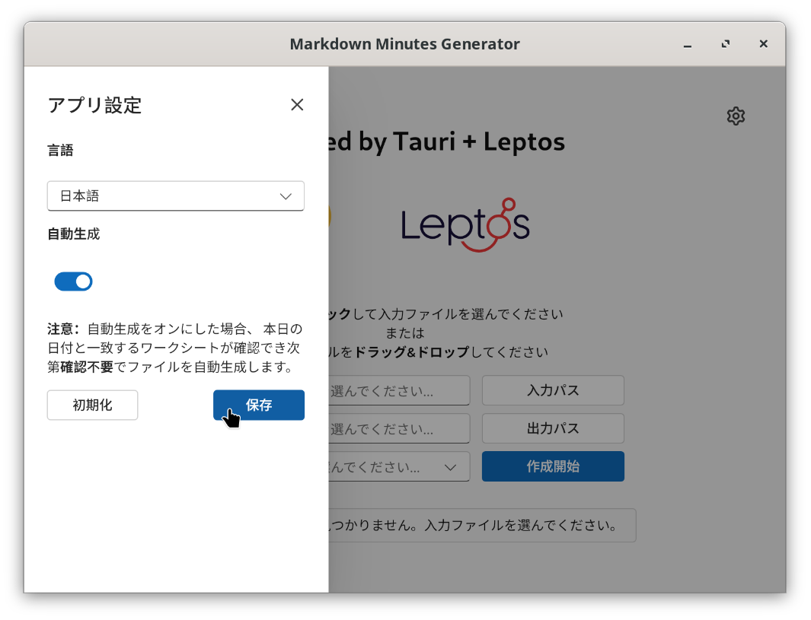

## 全体会議事録テンプレート作成アプリ

    

### What is this repo?

一个从 `Excel` 格式的会议章程文件生成 `Markdown` 格式的会议记录模板的小工具，使用 Tauri App 提供跨平台（Linux，Mac 以及
Windows）支持。支持英语、日语和简体中文界面。

内部用，只支持转换特定格式的日语 Excel 文件。

### Tech Stack

- [Rust](https://www.rust-lang.org): A language empowering everyone to build reliable and efficient software.
- [Tauri Apps](https://tauri.app): Create small, fast, secure, cross-platform applications.
- [Leptos](https://leptos.dev): A cutting-edge Rust framework for the modern web.
